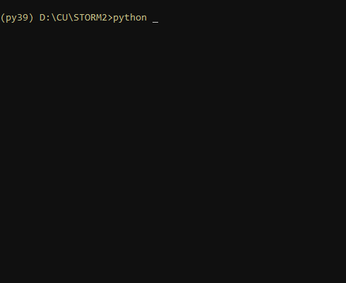
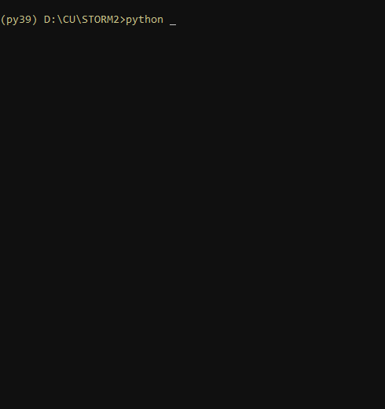

# STORM 2

[](https://github.com/feliperiosg/STORM2/releases)
[](https://www.python.org/)
[](https://mit-license.org/)

STORM 2 (STOchastic Rainstorm Model) is an upgrade on [STORM 1.0](https://github.com/blissville71/STORM), continuing to be a simple and flexible rainfall generator.

## FEATURES

- Simulates (circular) rainfall storms from a set of PDFs (Probability Density Functions).
- PDFs easily defined by the user (or retrieved from gauge data).
- Shapefile (SHP) of the catchment required.
- Provided a Digital Elevation Model (DEM), simulates rainfall storms with regard to altitude/elevation.
- Spatial resolution (and CRS - Coordinate Reference System) customizable.
- Spatial operations under a raster framework, which adds speed, versatility, and scalability.
- Optimal output storing in [NetCDF](https://www.unidata.ucar.edu/software/netcdf/) format.
- Allows rainfall simulation under future (and very likely) climate scenarios.

### Improvements over STORM 1.0

- Modelling of storm intensity and duration follows a (bi-variate) Gaussian copula framework.
- Modelling of such Intensity-Duration copulas can be applied at different elevation bands/ranges within the catchment.
- Modelling of storm occurrence follows a ~~Poisson Point Process~~ (i.e., random sampling from a uniform distribution, scaled to the season's duration).
- Modelling of storm's starting day-of-year (DOY), and time-of-day (TOD) follows a Circular Statistics approach (i.e., mixture of von Mises PDFs).
- Output compressed into (geo-referenced) NetCDF files, readily available for visualization (e.g., via [Panoply](https://www.giss.nasa.gov/tools/panoply/)).
- Pre-processing module to construct all necessary PDFs from gauge data.


## HOW TO RUN STORM 2

To smoothly run STORM 2 you'd essentially need two components/files: [PDFs](#pdf) and [Parameters](#par).

### <a name="pdf"></a>```PDFs```

The majority of the stochastic component of STORM 2 is located in the file: [Probabilty Desity Functions](./model_input/ProbabilityDensityFunctions_ONE--ANALOG.csv).
For every season, and for each variable to be modelled (or sampled from), this file contains the name of the distribution (following [scipy](https://docs.scipy.org/doc/scipy/reference/stats.html) nomenclature), and its (nameless) parameters.

There are roughly three ways to generate this file:

- <ins><a name="man"></a>Manual</ins>: You can directly (over-)write [this](./model_input/ProbabilityDensityFunctions_ONE--ANALOG.csv) (or [this](./model_input/ProbabilityDensityFunctions_TWO--ANALOG-py.csv)) PDF-files with whatever parameters (you think) suit your data the best.
For instance, if you want to model Total Seasonal Rainfall ```TOTALP``` for Season 1 (in the logarithmic-space) as a [left-skewed Gumbel](https://docs.scipy.org/doc/scipy/reference/generated/scipy.stats.gumbel_l.html#scipy.stats.gumbel_l) distribution with $\mu = 5.51$, and $\sigma^2 = 0.266$, write ```TOTALP_PDF1+gumbel_l,5.51,0.226```. If you want to model, for Season 2 (and for a -*previously defined*- elevation band "Z3"), Maximum Rainfall Intensity (at the storm's centre) ```MAXINT``` as a [generalized Pareto](https://docs.scipy.org/doc/scipy/reference/generated/scipy.stats.genpareto.html#scipy.stats.genpareto) distribution with $\mu = 0.1655$, $\sigma^2 = 0.45431$, and $skewness = 6.427$, write ```MAXINT_PDF2+Z3+genpareto,0.1655,0.45431,6.427```, for instance.

- <ins>Automatic</ins>: You can use the [pre_processing](./pre_processing.py) script. If you have gauge data stored/post-processed in [this way](./model_input/data_WG/gage_data--1953Aug18-1999Dec29_eventh--ANALOG.csv) (for storm rainfall events), and [this way](./model_input/data_WG/gage_data--1953Aug-1999Dec_aggregateh--ANALOG.csv) (for monthly aggregated rainfall), the script seeks through the data, fits the best PDF for each variable (for all the requested seasons), and generates the aforementioned file of PDFs.</br>


- <ins>Hybrid:</ins> If you have knowledge/idea of the PDFs that describe the storm statistics (see [<ins>Manual</ins>](#man)), you can still use the [pre_processing](./pre_processing.py) script to pass these parameters as (Python) [*dictionaries*](https://docs.python.org/3/tutorial/datastructures.html#dictionaries).

For each season you want to model/simulate/validate in STORM 2, you'd need at least PDFs for the variables ```TOTALP``` - Total Seasonal Rainfall, ```RADIUS``` - Maximum Storm Radius, ```BETPAR``` - Decay Rate (of maximum rainfall from the storm's centre towards its maximum radius), ```MAXINT``` - Maximum Rainfall Intensity, ```AVGDUR``` - (Average) Storm Duration, ```COPULA``` - Copula's Correlation parameter, and ```DOYEAR``` - Storm's Starting Date. ```DATIME``` - Storm's Starting Time is optional.

### <a name="par"></a>```PARAMETERS```

The file [parameters](./parameters.py) hosts the main file-paths, variables, and constants which define the storm's modelling characteristics, along with potential climate scenarios, and all the spatio(-temporal) attributes of the catchment.

It is divided into two sections:

- *SOFT parameters*: These parameters define the type of run (*SIMulation*/*VALidation*) - ```MODE```, the number of seasons (*1* or *2* -or even more!, potentially) - ```SEASONS```, the number of *SIMulations*/*VALidations* per season - ```NUMSIMS```, the number of years to *SIMulate*/*VALidate* - ```NUMSIMYRS```, and scaling factors -```PTOT_SC```, ```PTOT_SF```, ```STORMINESS_SC```, ```STORMINESS_SF```- to (steadily OR progressively) *increase*/*decrease* the variables ```TOTALP``` and/or ```MAXINT``` in order to represent (future) climatic changing conditions.
These parameters can be either defined in this file or passed/modified directly from the command prompt (or console) when [<ins>running</ins>](#run) STORM 2.

- *HARD parameters*: These parameters define the location of all input/output files, the elevation bands for which modelling of storm rainfall could be split into, the resolution and CRS of the spatial domain, and some time-domain specifications.
These parameters cannot be passed from the command prompt.


### <a name="run"></a>```RUNNING IT```

You can run STORM 2 in its default settings (see [<ins>PARAMETERS</ins>](#par)) by calling the [storm script](./storm.py) as:
```
python storm.py     # (from your Terminal -and inside your CONDA environment, if so)
%%python storm.py   # (from your Python console)
```
Type ```python storm.py -h``` to prompt what parameters (along with their short explanation) can be passed as optional arguments:

```
(py39) path-to\STORM>python storm.py -h
usage: storm.py [-h] [-m {simulation,validation}] [-w {1,2}] [-n NUMSIMS] [-y NUMSIMYRS]
                [-ps PTOT_SC [PTOT_SC ...]] [-pf PTOT_SF [PTOT_SF ...]]
                [-ss STORMINESS_SC [STORMINESS_SC ...]] [-sf STORMINESS_SF [STORMINESS_SF ...]] [--version]

STOchastic Rainstorm Model [STORM v2.0]

optional arguments:
  -h, --help            show this help message and exit
  -m {simulation,validation}, --MODE {simulation,validation}
                        Type of Run (case-insensitive) (default: SImuLAtiON)
  -w {1,2}, --SEASONS {1,2}
                        Number of Seasons (per Run) (default: 1)
  -n NUMSIMS, --NUMSIMS NUMSIMS
                        Number of runs per Season (default: 2)
  -y NUMSIMYRS, --NUMSIMYRS NUMSIMYRS
                        Number of years per run (per Season) (default: 3)
  -ps PTOT_SC [PTOT_SC ...], --PTOT_SC PTOT_SC [PTOT_SC ...]
                        Relative change in the seasonal rain equally applied to every simulated year. (one
                        signed scalar per Season).
  -pf PTOT_SF [PTOT_SF ...], --PTOT_SF PTOT_SF [PTOT_SF ...]
                        Relative change in the seasonal rain progressively applied to every simulated year.
                        (one signed scalar per Season).
  -ss STORMINESS_SC [STORMINESS_SC ...], --STORMINESS_SC STORMINESS_SC [STORMINESS_SC ...]
                        Relative change in the observed intensity equally applied to every simulated year.
                        (one signed scalar per Season).
  -sf STORMINESS_SF [STORMINESS_SF ...], --STORMINESS_SF STORMINESS_SF [STORMINESS_SF ...]
                        Relative change in the observed intensity progressively applied to every simulated
                        year. (one signed scalar per Season).
  --version             show program's version number and exit
```



## how does it look like?
<p align="center">
    
</p>

The GIF above is produced by the [animation script](./xtras/animation.py).

##

Authored and maintained by Manuel F.
> GitHub [@feliperiosg](https://github.com/feliperiosg) &nbsp;&middot;&nbsp;
> Twitter [@feLlx](https://mobile.twitter.com/fel_lx)